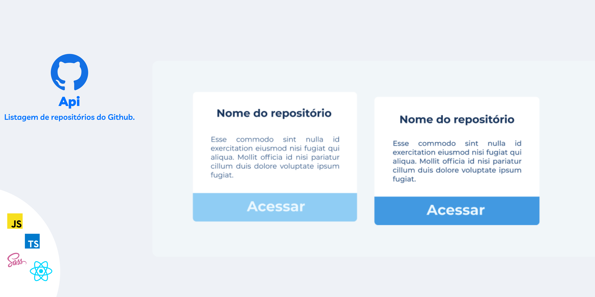
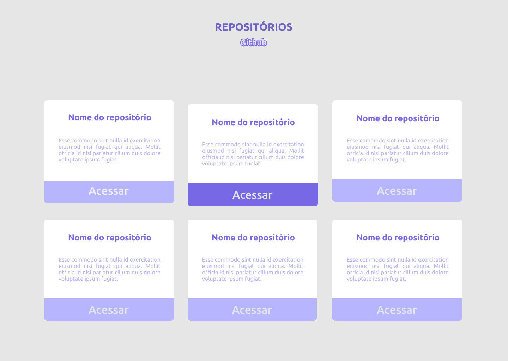
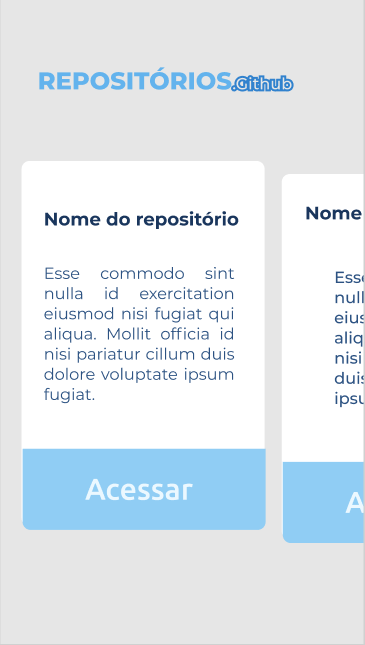

  
<h4 align="center">Lista de repositórios do Github</h4>

<h5 align="center">Aplicação feita no modulo 1 do curso Ignite da Rocketseat que tem como objetivo listar os repostirórios do Githu através de sua API.</h5>
<h4 align="center">Versão Desktop</h4>
  
<h4 align="center">Versão Mobile</h4>
  
  
 <a href="https://www.figma.com/file/dIZPFDNZEcNrm7OXWeubrJ/UI---PROJECTS?node-id=0%3A1">🔗 Acesse a UI no figma.</a>

<h4 align="center">Para startar Aplicação, use o comando:</h4>

```
yarn dev
```
